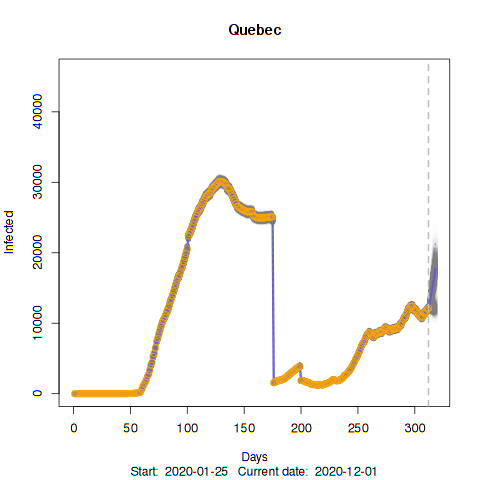
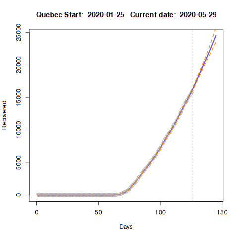
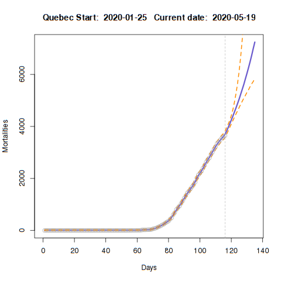
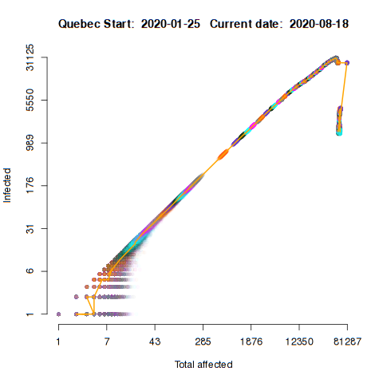
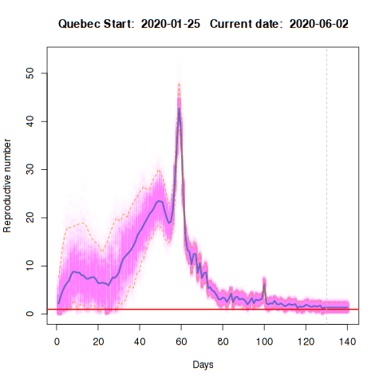
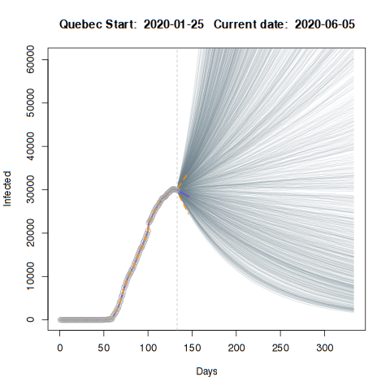

---

# Current COVID-19 status for Quebec:

*NOTE* It seems Quebec, the reporting of Covid-19 changed from daily to weakly updates in late June 2020 (https://www.cbc.ca/news/canada/montreal/quebec-covid-19-death-1.5626260). But the underlying data are still recored on a daily basis by (https://github.com/ishaberry/Covid19Canada). The discontinuity observed in that time frame, therefore, suggests other changes in the reporting of "Infected" and "Recovered" cases. This renders parameter estimates (such as a the effective reproductive number) not useful in its current form. To adjust for this, a new set of parameters should be estimated for the two time periods, pre- and post-discontinuity. I do not have time to do this, but it is really simple to do (adding another set of parameters for the vital rates). If you need to do this, let me know. For now, I will continue with routine updates as the overall time trends are still informative.

Here we show a few elements of COVID-19 status by province based on data compiled from publicly available information.

The figures are generated from https://github.com/jae0/adapt/blob/master/inst/scripts/example_parameter_estimation_SIR_provinces_of_Canada.R. More information about the models and data can be found on the 

Please note that these results are generated from an automated process. There might be problems due to unforeseen issues. I will keep tweaking and updating this as much as possible.

---

# Infected number of people with simple projections

The number of infected people as a function of time (days) in circles. Vertical line represents "today". The blue line shown is the model fit to a modified SIR model with 95% Credible Intervals in orange  and posterior distributions in cyan. Simple deterministic (mean-field) forecasts from the recursive model are shown.

---

# Recovered number of people with simple projections

The number of recovered people as a function of time (days) in circles. Vertical line represents "today". The blue line shown is the model median fit to a modified SIR model with posterior distributions in cyan. Simple deterministic (mean-field) forecasts from the recursive model are shown.

---

# Number of deaths with simple projections

The number of deaths as a function of time (days) in circles. Vertical line represents "today". The blue line shown is the model fit to a modified SIR model with 95% Credible Intervals in orange  and posterior distributions in cyan. Simple deterministic (mean-field) forecasts from the recursive model are shown.

---

# Infected vs total affected population

The number of infected people as a function of the total number of people affected by Covid-19 (infected, recovered, mortality), on log10 - log10 scales. This is commonly used to pinpoint the moment of the flattening of the infection curve (i.e., when it deviates from an exponential increase). To help identify days, they are coloured in alternating sequences.  These are posterior estimates derived from the model fit. The median value is shown as a solid line.

---

# Reproductive number

How the reproductive number has been changing over the course of the epidemic. If this value is below the critical value of 1, then disease spread is being controlled. If it is above 1, an epidemic is more likely. The blue line shown is the model fit to a modified SIR model with 95% Credible Intervals in orange and posterior distributions in cyan.

The current and recent estimates of the reproductive number (posterior distribution) in relation to the critical value of  1 (red line)!

---
# Forecast with stochastic simulations

Here, individual trajectories of stochastic simulations are shown. These are based upon the joint posterior distributions of the parameter estimates for the most "current day", obtained from the above analysis. These trajectories represent possible futures, accounting for small number stochasticity (unlike the mean-field ODE-based "simple" predictions). This essentially  amounts to assuming that the current "situation" remains constant/consistent (i.e., control measures and population behaviours encapsualted in the joint-posterior distributions of the model parameters).

