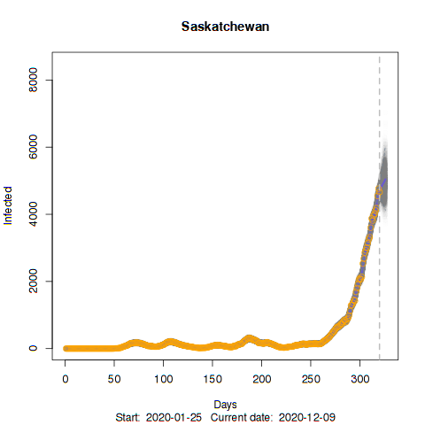
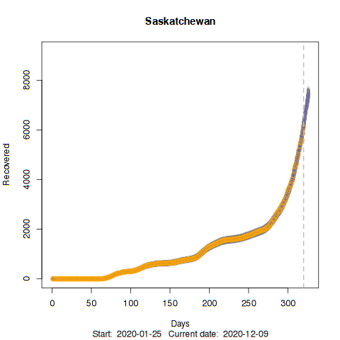
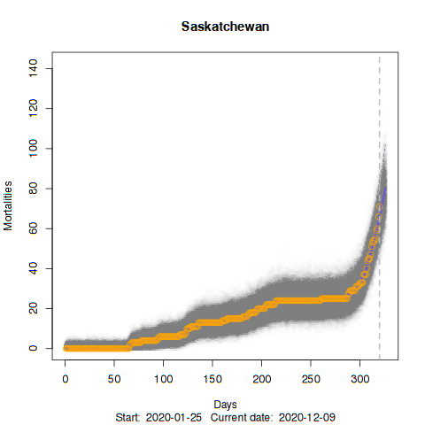
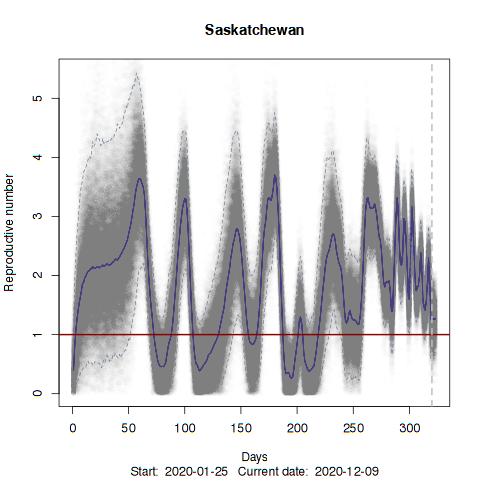
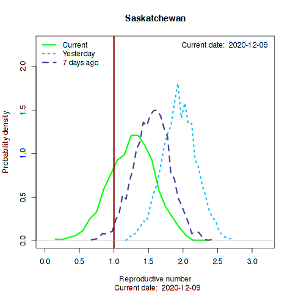
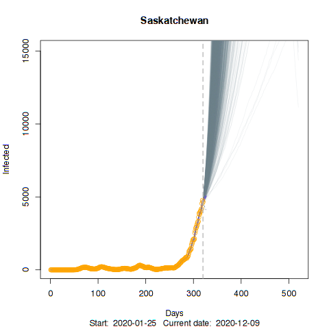

---

# Current COVID-19 status for Saskatchewan:

Here we show a few elements of COVID-19 status by province based on data compiled from publicly available information.

The figures are generated from https://github.com/jae0/adapt/blob/master/inst/scripts/example_parameter_estimation_SIR_provinces_of_Canada.R. More information about the models and data can be found on the 

Please note that these results are generated from an automated process. There might be problems due to unforeseen issues. I will keep tweaking and updating this as much as possible.

---

# Infected number of people with simple projections

The number of infected people as a function of time (days) in circles. Vertical line represents "today". The blue line shown is the model fit to a modified SIR model with 95% Credible Intervals in orange. Simple deterministic (mean-field) forecasts from the recursive model are shown.

---

# Recovered number of people with simple projections

The number of recovered people as a function of time (days) in circles. Vertical line represents "today". The blue line shown is the model fit to a modified SIR model with 95% Credible Intervals in orange. Simple deterministic (mean-field) forecasts from the recursive model are shown.

---

# Number of deaths with simple projections

The number of deaths as a function of time (days) in circles. Vertical line represents "today". The blue line shown is the model fit to a modified SIR model with 95% Credible Intervals in orange. Simple deterministic (mean-field) forecasts from the recursive model are shown.

---

# Reproductive number

How the reproductive number has been changing over the course of the epidemic. If this value is below the critical value of 1, then disease spread is being controlled. If it is above 1, an epidemic is more likely. The blue line shown is the model fit to a modified SIR model with 95% Credible Intervals in orange.

The current and recent estimates of the reproductive number (posterior distribution) in relation to the critical value of  1 (red line)!

---
# Forecast with stochastic simulations

Here, individual trajectories of stochastic simulations are shown. These are based upon the joint posterior distributions of the parameter estimates for the most "current day", obtained from the above analysis. These trajectories represent possible futures, accounting for small number stochasticity (unlike the mean-field ODE-based "simple" predictions). This essentially  amounts to assuming that the current "situation" remains constant/consistent (i.e., control measures and population behaviours encapsualted in the joint-posterior distributions of the model parameters).

